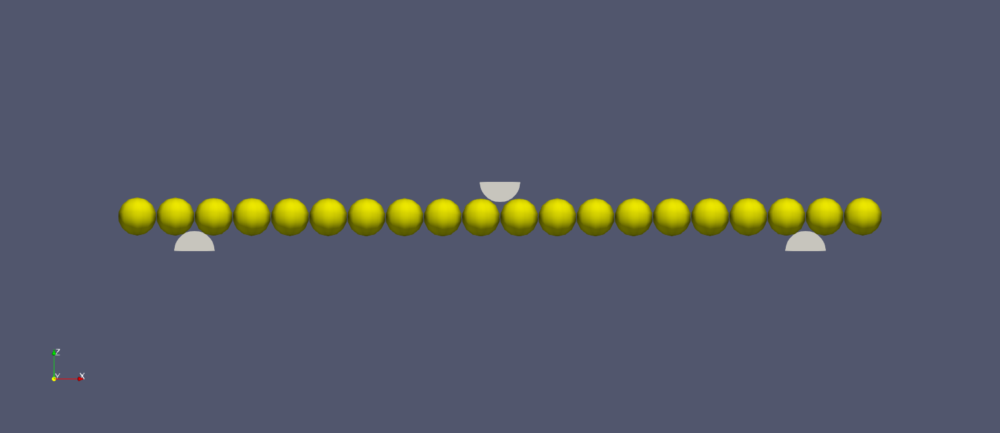
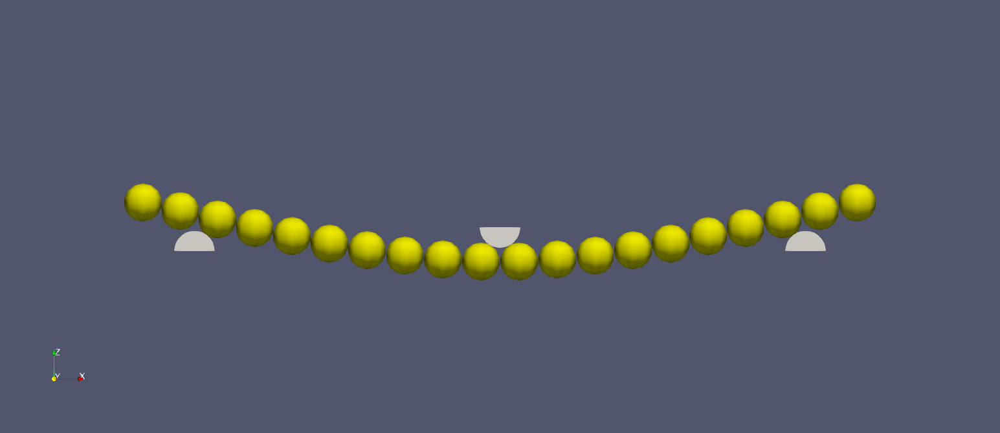

# LIGGGHTS Flexible Fibers

[Home](Home)

[How to Install](how_to_install)

[Commands](commands)

[Tutorials](tutorial_main_page)

## Bond Package 3-Point-Bending Tutorial

### Simulation Description

This tutorial simulates the 3-point-bending test of a fiber. A fiber with
diameter 2.83 mm and length of 55 mm, is placed on to cylindrical supports
under atoms 2 and 3, and atoms n-2 and n-1.

The plunger plungs into the fiber at 4 mm/s until the plunger travels 2 mm.

Once the plunger reaches the max displacement, it then travels back to where
it began at 4 mm/s.
