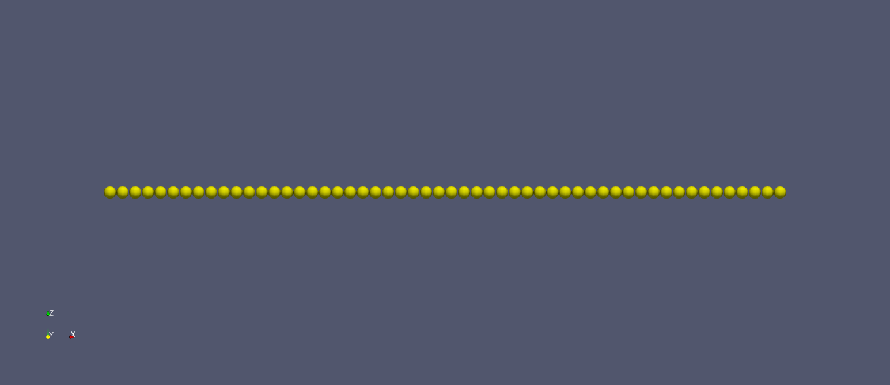
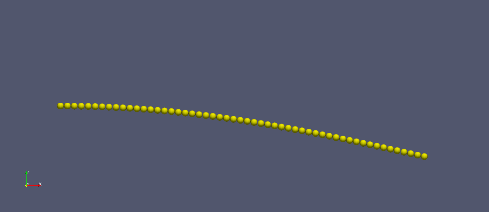
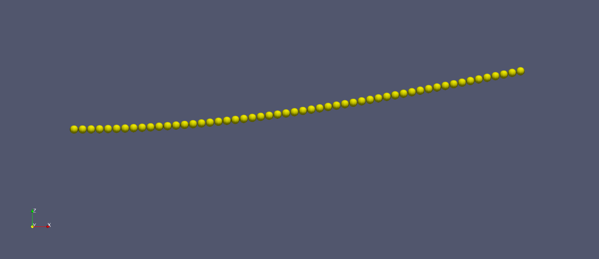

# LIGGGHTS Flexible Fibers

[Home](Home)

[How to Install](how_to_install)

[Commands](commands)

[Tutorials](tutorial_main_page)

## Bond Package Cantilever Beam Tutorial

### Simulation Description

This tutorial simulates the cantilever beam test of a fiber. A fiber with
diameter 2.83 mm and length of 150 mm, is fixed on the left side using a
[fix frozen](fix_freeze) command, while the other end is displaced downwards
to ??? mm at ??? mm/s.

Once the beam has been deflected, it is held in the spot for ??? seconds to
allow the fiber to settle.

After this settle time, the beam is then allowed to vibrate.

